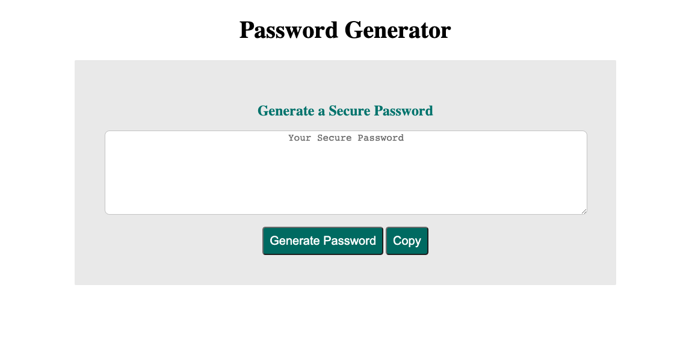

# password-generator
This repository ("password-generator") is where I built a secure password generator using html, css and JavaScript. 
The goal for the project was to create an app which the users can generate their own secure password by chosing criteria given (Uppercase, Lowercase, Numbers and Special characters) as well as th length of the password of their choice. 

Deployed Website: https://mk-kwon.github.io/password-generator/

 

